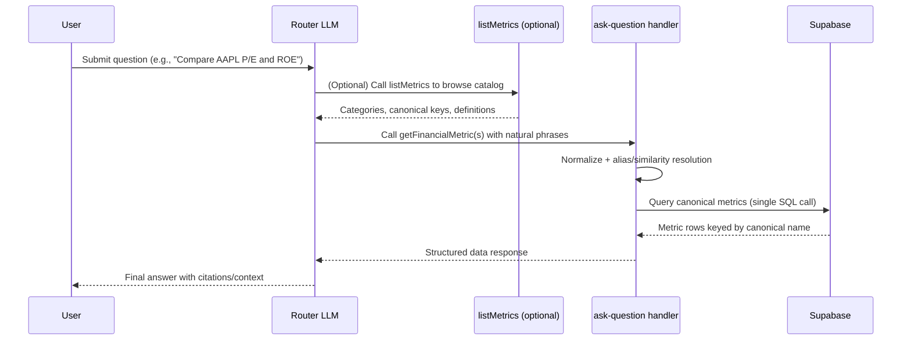

# Financial Metric Router Recommendation

## Overview
We recently ingested 139 new financial metrics into Supabase, but the Q&A router only exposes nine of them through the legacy `getAaplFinancialsByMetric` tool. The LLM can only call tools and metric identifiers that appear in its prompt, so the new data is effectively invisible. This document outlines a server-side upgrade that keeps the tool menu small, lets users speak naturally, and prevents fragile prompt edits from becoming the only way to reference metrics.

## Current Flow (Today)
1. **Tool selection:** The router prompt lists four tools and a short set of hard-coded metric names. The LLM picks a tool purely from that description.
2. **Argument filling:** Whatever metric string the LLM outputs (e.g., `"eps"`) is sent directly to the server.
3. **Database query:** The server blindly forwards the string to Supabase. If the string doesn't match an existing metric column, the query fails and the user gets no answer.
4. **Multi-metric questions:** Each requested metric requires a separate tool call, so the conversation incurs multiple round-trips, higher token cost, and more validation steps.

### Pain Points
- Adding or renaming metrics demands prompt surgery; the model has to memorize every canonical label.
- Natural phrasing such as "price to earnings" or "p/e" is rejected because only `peRatio` exists in code.
- Multi-metric questions trigger repeated tool calls, inflating latency and cost.

## Proposed Flow
Introduce a single `getFinancialMetric` tool with two invocation styles (singular + plural) and let the server translate human phrasing into canonical metric IDs before querying Supabase.

```
args (singular): { symbol: string, metricName: string, fiscalYear?: number, limit?: number }
args (plural):   { symbol: string, metricNames: string[], fiscalYear?: number, limit?: number }
```

### Step-by-Step
1. **LLM still chooses the same tool** based on the prompt, but it may now pass any metric phrase the user requested.
2. **Alias translation:** Before hitting the database, normalize each requested metric (trim, lowercase) and look it up in an alias map that you own.
3. **Similarity fallback:** If no alias exists yet, compute the closest canonical metric using either a tiny embedding model (cosine similarity) or a string-distance metric like Levenshtein. Record the best match.
4. **Canonical query:** Send only verified canonical names (e.g., `peRatio`, `returnOnEquity`) to Supabase. Fetch all requested metrics in a single `WHERE metric_name = ANY($1)` query when the plural form is used.
5. **Structured response:** Return the data keyed by canonical name so the LLM can format the answer and cite the correct metric labels.

## Why This Helps
- **Reliability:** Users can say "price earnings ratio", "P/E", or "PE multiple" and still land on `peRatio`. Translation happens in code, not in the prompt.
- **Scalability:** Adding a metric only requires appending it to the canonical list (and maybe a few aliases). No need to expand the tool menu or retrain prompt behavior.
- **Efficiency:** Multi-metric queries run in one round-trip, cutting API latency, Supabase load, and token usage.
- **Clarity:** The tool description can finally describe data grain (annual rows), supported filters (symbol, optional fiscalYear, limit), and validation expectations without enumerating 139 metrics inline.

## Implementation Plan
1. **Define canonical catalog:** Export the full list of 139 metric IDs from `financial_metrics`. Store it in code (constant array or config) so validation is centralized.
2. **Create alias map:** Start with common synonyms and abbreviations. Example structure:
   ```ts
   const metricAliases = {
     "price to earnings": "peRatio",
     "p/e": "peRatio",
     "return on equity": "returnOnEquity",
     "roe": "returnOnEquity",
     // ...
   } as const;
   ```
3. **Add normalization helper:** Lowercase, trim, and strip punctuation before looking up aliases or running similarity checks.
4. **Add similarity fallback:**
   - **Option A (fast):** Use a lightweight string-distance function (Levenshtein). Accept the closest match if distance is below a threshold.
   - **Option B (smarter):** Use embeddings (e.g., `text-embedding-3-small`). Convert both the input phrase and canonical names into vectors, compute cosine similarity, and pick the highest.
5. **Extend the tool schema:** Update `lib/tools.ts` to describe the new arguments and document the data grain and filters. Mention that the tool returns annual metrics from `financial_metrics`.
6. **Implement plural handler:** In `app/actions/ask-question.ts`, handle either `metricName` or `metricNames`. For the plural path, resolve every alias first, dedupe, then fetch all rows in one SQL call.
7. **Validation + logging:** If translation fails, return a clear error (`"Unknown metric 'profit margin percent'"`) and log the phrase so you can add an alias later.
8. **Update prompts lightly:** Keep the tool count at five by replacing `getAaplFinancialsByMetric` with the new tool. Group metrics by category in the description, but rely on the server translation for accuracy.

## Testing Checklist
- Unit-test the alias helper with common variations (`"price to earnings"`, `"P/E"`, `"pe ratio"`).
- Add integration tests that call the plural path with three metrics and verify only one SQL request fires.
- Manually run a few router prompts to confirm the LLM keeps choosing the new tool for both single and multi-metric questions.
- Validate that the error message for unknown phrases is actionable and points you toward updating the alias map.

## Future Enhancements
- **Alias telemetry:** Log unmatched phrases so product can prioritize new synonyms.
- **Auto-aliasing:** When similarity fallback triggers, cache the inferred mapping so future calls skip recomputation.
- **UI hints:** Surface canonical metric names (or friendly labels) in the frontend so users learn what terminology works best.
- **Quarterly support:** If quarterly data gets ingested later, expand the tool description and handler to accept a `period` field (`annual | quarterly`).

Adopting this flow places the burden of accuracy on deterministic server logic rather than on prompt wording, unlocking the 139 new metrics without overwhelming either the LLM or future developers.

## End-to-End Flow (Mermaid)


